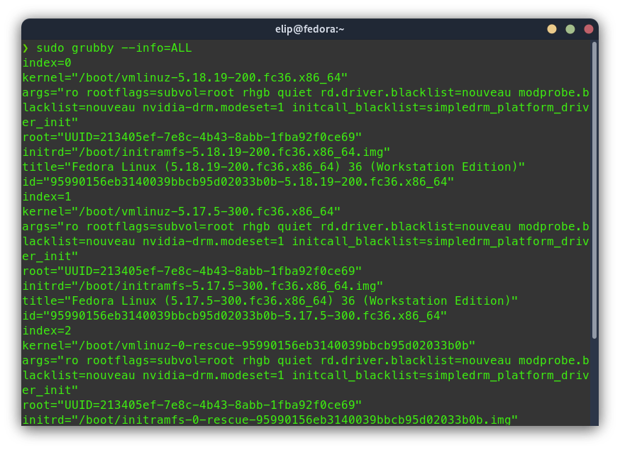
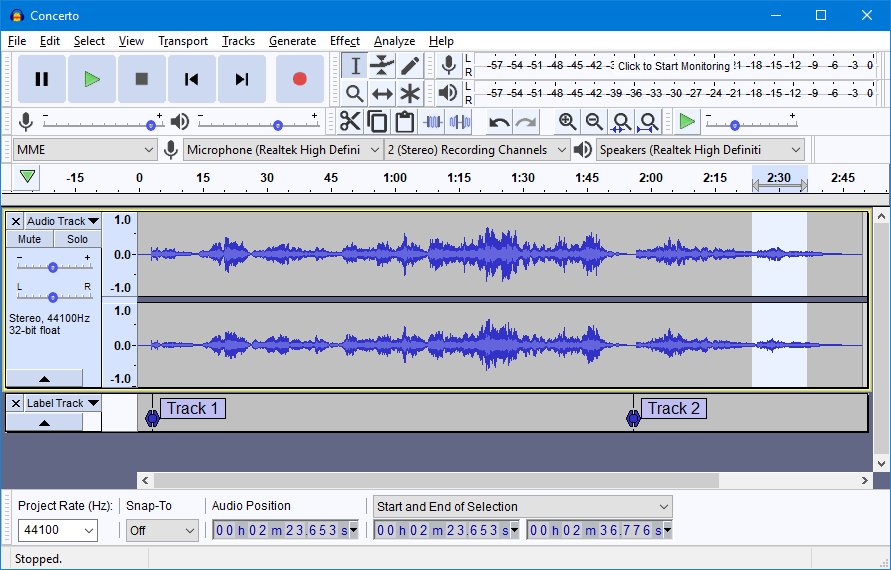

<font size =6>**Hướng dẫn cài đặt cơ bản cho người mới dùng linux**</font>
<!-- Font sizr of heading 1 is 6 -->

## Mục lục
- [Các lệnh cơ bản](#các-lệnh-cơ-bản)
  - [Kiểm tra phiên bản của distro](#kiểm-tra-phiên-bản-của-distro)
  - [Kiểm tra Display Server](#kiểm-tra-display-server)
  - [Kiểm tra các gói đã cài đặt](#kiểm-tra-các-gói-đã-cài-đặt)
- [Thao tác với kernel](#thao-tác-với-kernel)
  - [Làm quen với kernel](#làm-quen-với-kernel)
  - [Cập nhật kernel](#cập-nhật-kernel)
  - [Chọn kernel làm mặc định](#chọn-kernel-làm-mặc-định)
  - [Xóa kernel](#xóa-kernel)
- [Cửa hàng ứng dụng gói Flathub và Snap Store](#cửa-hàng-ứng-dụng-gói-flathub-và-snap-store) 
- [Sửa lỗi headphone microphone](#sửa-lỗi-headphone-microphone)
- [Cài đặt zsh](#cài-đặt-zsh)
- [Cài đặt oh-my-zsh](#cài-đặt-oh-my-zsh)
- [Cài đặt zsh autosuggestions](#cài-đặt-zsh-autosuggestions)
- [Theme Power10k cho zsh shell](#theme-power10k-cho-zsh-shell)
- [Cài đặt bộ gõ tiếng Việt](#cài-đặt-bộ-gõ-tiếng-việt)
  - [Ubuntu](#ubuntu)
  - [Cài đặt từ mã nguồn](#cài-đặt-từ-mã-nguồn)
    - [Gỡ cài đặt](#gỡ-cài-đặt)
- [Cài đặt neofetch](#cài-đặt-neofetch)
- [Cài đặt bashtop](#cài-đặt-bashtop)
- [Terminal](#terminal)
  - [Terminator](#terminator)
  - [Terminology](#terminology)
- [Cài đặt phím tắt](#cài-đặt-phím-tắt)
  - [Phím tắt mở Terminal mới](#phím-tắt-mở-terminal-mới)
  - [Phím tắt đến Desktop](#phím-tắt-đến-desktop)
- [Gnome extention](#gnome-extention)
- [GNOME Tweaks](#gnome-tweaks)
- [Themes](#themes)
- [Icons](#icons)
- [Các ứng dụng thu âm](#các-ứng-dụng-thu-âm)
  - [Gnome Sound Recorder](#gnome-sound-recorder)
  - [Audio Recorder](#audio-recorder)
  - [Audacity](#audacity)
  - [Ardour](#ardour)
- [Cài đặt NVIDIA Drivers cho các RedHat distro](#cài-đặt-nvidia-drivers-cho-các-redhat-distro)
  - [Kiểm tra GPUs và Drivers đã dùng](#kiểm-tra-gpus-và-drivers-đã-dùng)
  - [Cập nhật hệ thống](#cập-nhật-hệ-thống)
  - [Cài đặt EPEL](#cài-đặt-epel)
  - [Tùy chọn - Xóa EPEL](#tùy-chọn---xóa-epel)
  - [Cài đặt kho lưu trữ tổng hợp RPM Fusion](#cài-đặt-kho-lưu-trữ-tổng-hợp-rpm-fusion)
  - [Tùy chọn thêm](#tùy-chọn-thêm)
  - [Cài đặt NVIDIA Drivers](#cài-đặt-nvidia-drivers)
  - [Xác minh cài đặt NVIDIA Drivers](#xác-minh-cài-đặt-nvidia-drivers)
  - [Cập nhật Nvidia Drivers](#cập-nhật-nvidia-drivers)
  - [Cách xóa Nvidia Drivers và RollBack](#cách-xóa-nvidia-drivers-và-rollback)
- [Chuyển đổi cạc đồ họa NVIDIA và Intel/AMD](#chuyển-đổi-cạc-đồ-họa-nvidia-và-intelamd)
  - [Cài đặt Envy Control](#cài-đặt-envy-control)
  - [Chuyển đổi cạc đồ hoa thông qua System Menu](#chuyển-đổi-cạc-đồ-hoa-thông-qua-system-menu)
- [Tham khảo](#tham-khảo)

## Các lệnh cơ bản

### Kiểm tra phiên bản của distro

Linux:
```console
cat /etc/os-release
```

<p align="center">
  
</p>

Fedora:
```console
echo $(rpm -E %fedora)
```

```
# Output:
# 36
```

### Kiểm tra Display Server

Kiểm tra là [Wayland](https://quantrimang.com/cong-nghe/chu-y-khi-su-dung-linux-voi-wayland-168753) hay Xorg: 

```console
echo $XDG_SESSION_TYPE
```

```
# Output:
# wayland
```

Để biết thêm sự khác biệt giữa Wayland và Xorg thì hãy xem tại [đây](https://www.secjuice.com/wayland-vs-xorg/).

### Kiểm tra các gói đã cài đặt

Debian/Ubuntu:

```console
sudo apt list
# or
# sudo apt list | grep <package name>
```

Fedora/RHEL/AlmaLinux:

```console
sudo dnf list installed
# or
# sudo dnf list
# sudo dnf list installed | grep <package name>
```

## Thao tác với kernel

### Làm quen với kernel

Xem kernel hiện tại: 
```console
uname -r
```

<p align="center">
  
</p>

Xem thời gian cài đặt kernel hiện tại:

```console
uname -v
```

<p align="center">
  
</p>

Xem danh sách các kernel:

```console
dnf list kernel
```

<p align="center">
  
</p>

Xem toàn bộ thông tin về kernel: 

```console
dnf info kernel
# dnf list kernel
```

<p align="center">
  
</p>

Phiên bản kernel có cấu trúc:

```
<major_version>-<minor_version>-<release>.<architecture>
hoặc 
<major_version>-<release>.<architecture>
Ví dụ: 5.17.5-300.fc36.x86_64
```

Tại dòng **Available Packages** ta có thể xem các kernel phiên bản mới chưa được cài đặt.

Hoặc cũng có thể nhìn vào màu sắc của terminal để xác định. Nhìn màu sắc của `kernel` ta có thể thấy được kernel phiên bản 5.19.4 là phiên bản mới chưa được cài đặt vào máy.

### Cập nhật kernel

*** Cảnh báo: Sử dụng DNF để cài đặt các kernel bất cứ khi nào có thể.
Khi có thể, hãy sử dụng trình quản lý gói ***DNF*** hoặc ***PackageKit*** để cài đặt kernel mới bởi vì nó luôn ***cài đặt*** một kernel mới thay vì thay thế phiên bản hiện tại, điều này có thể tránh việc hệ thống của bạn không thể khởi động.

*** Hãy giữ lại kernel phiên bản cũ khi thực hiện nâng cấp kernel.
Chúng tôi đặc biệt đề xuất điều này trong trường hợp có nhiều lỗi với kernel mới.

Để cập nhật kernel mới nhất, hãy chạy câu lệnh DNF dưới đây, nó tự động cài đặt phiên bản kernel mới phù hợp nhất với hệ thống của bạn.

```console
sudo dnf install kernel --best
```

Nếu muốn cài đặt một kernel cụ thể thì dùng lệnh sau:

```
# sudo dnf install kernel-<major_version>-<minor_version>-<release>.<architecture>
# hoặc
# sudo dnf install kernel-<major_version>-<release>.<architecture>

# Ví dụ: 
sudo dnf install kernel-5.19.4-200.fc36.x86_64
```

Để các thay đổi có hiệu lực, khởi động lại hệ thống. Nếu không, hệ thống của bạn vẫn sẽ chạy trên kernel cũ.

```console
reboot
```

### Chọn kernel làm mặc định

Nếu có nhiều phiên bản của kernel được cài đặt thì sẽ có một kernel được chọn làm kernel mặc định khi khởi động máy tính. Ta cũng có thể chọn một phiên bản khác để làm kernel mặc định.

Câu lệnh **grubby** là một công cụ được sử dụng để cấu hình bootloader. Tuy nhiên, câu lệnh grubby cũng có thể được sử dụng để hiển thị thông tin của phiên bản kernel.

Chạy câu lệnh grubby dưới đây để in ra vị trí lưu và phiên bản của kernel mặc định khi boot.

```console
sudo grubby --default-kernel
```
<p align="center">
  
</p>

Tiếp theo, câu lệnh bên dưới sẽ liệt kê tất cả các kernel đã cài đặt, nó cũng in ra tất cả các thành phần của GRUB của tất các các kernel đó.

```console
sudo grubby --info=ALL
```

<p align="center">
  
</p>

Để cài đặt phiên bản kernel như kernel mặc định, ta lấy vị trí của kernel các bước trước và áp dụng vào câu lệnh bên dưới. Ví dụ, tôi chuyển /boot/vmlinuz-5.17.5-300.fc36.x86_64 thành phiên bản kernel mặc định thay vì boot/vmlinuz-5.18.19-200.fc36.x86_64.

```console
sudo grubby --set-default <kernel>
# sudo grubby --set-default /boot/vmlinuz-5.17.5-300.fc36.x86_64
```

<p align="center">
  
</p>

Khởi động lại hệ thống để các thay đổi được áp dụng.

```console
reboot
```

Việc cập nhật kernel không còn là một tác vụ khó khăn nữa. 

### Xóa kernel

Để xóa toàn bộ kernel, hãy dùng câu lệnh bên dưới:

```
sudo dnf remove $(rpm -qa | grep ^kernel | grep <kernel-version>)
```

```console
# xóa phiên bản kernel 5.18.xxx
# sudo dnf remove $(rpm -qa | grep ^kernel | grep 5.18)
```

Sau đó khởi động lại để áp dụng thay đổi và kiểm tra xem menu boot đã xóa phiên bản kernel đó hay chưa.

```console
reboot
```

Nếu chưa, hãy thử rebuilding grub menu:

```console
sudo mkconfig-grub2 -o /boot/efi/EFI/fedora/grub.cfg
```

(Câu lệnh trên giả định rằng bạn đang chạy trên hệ thống UEFI).

## Cửa hàng ứng dụng gói Flathub và Snap Store

Flathub và Snap Store là hai trang web phát triển xung quanh hai định dạng gói phổ quát riêng biệt dành cho Linux: Flakpak và snap.

Ý tưởng đằng sau cả hai định dạng gói này là chúng cung cấp cách phân phối ứng dụng trên Linux, hoạt động bất kể bạn sử dụng bản phân phối nào. Các định dạng này cũng cung cấp những cải tiến bảo mật. Cả hai đều có thể cách ly các ứng dụng với nhau, để một phần mềm không thể truy cập vào các hình ảnh hoặc mật khẩu mà bạn đã mở ở nơi khác trên desktop.

`Flatpak` được tích hợp rất nhiều vào môi trường desktop GNOME, nhưng nó vẫn hoạt động với những môi trường khác. Nhiều bản phân phối Linux đã coi Flatpak là định dạng gói phổ biến ưa thích. Flatpak là một dự án cộng đồng, mặc dù các công ty tư nhân Red Hat và Endless đã tài trợ phần lớn cho sự phát triển của công cụ này.

`Snap` là một định dạng file đến từ Canonical, công ty tạo ra phân phối Linux Ubuntu. Không giống như Flatpak, snap ban đầu được dành cho các máy chủ. Mặc dù snap hoạt động trên rất nhiều bản phân phối Linux khác nhau, nhưng chúng lại cực kỳ phù hợp với Ubuntu. Tất nhiên, với số lượng người sử dụng Ubuntu lớn hơn rất nhiều so với các bản phân phối khác, Snap Store không hề thiếu các ứng dụng.

Xem chi tiết tại [đây](https://quantrimang.com/cong-nghe/so-sanh-flathub-va-snap-store-166089#:~:text=Snap%20l%C3%A0%20m%E1%BB%99t%20%C4%91%E1%BB%8Bnh%20d%E1%BA%A1ng,k%E1%BB%B3%20ph%C3%B9%20h%E1%BB%A3p%20v%E1%BB%9Bi%20Ubuntu)

## Sửa lỗi headphone microphone

Khi cắm tai nghe có microphone vào máy, linux có thể không nhận dạng được microphone. Để sữa lỗi này ta làm theo các bước bên dưới.

Chạy câu lệnh: 

```console
hdajackretask
```

Chọn như hình: 

<p align="center">
  
</p>

Chọn `Apply Now`, nhập password.

Nếu lỗi thì chọn `Install boot override` sau đó khởi động lại máy. 

Tiếp theo chạy lệnh cli `alsamixer`.

Chọn như hình: 

<p align="center">
  
</p>

Chỉnh như hình: 

<p align="center">
  
</p>

Nhấn nút **M** hoặc **,** hoặc **.** để chuyển từ `MM -> 00`

Nhấn `Esc` để thoát.

Nếu cách này không thành công thì ta tiếp tục thử chạy câu lệnh bên dưới:   
> the issue is most likely in wireplumber not pipewire itself. People have been switching that for pipewire-media-server instead in the short term:

``` console 
dnf swap wireplumber pipewire-media-session
```

Xong!

Tham khảo: 
https://www.reddit.com/r/Fedora/comments/qzaofq/headset_mic_not_working/

https://www.youtube.com/watch?v=yx33W-c4Cmg 

https://teddit.net/r/Fedora/comments/qmtl59/no_sound_audio_after_upgrade_to_fedora_35/

## Cài đặt zsh

> Zsh is a shell designed for interactive use, although it is also a powerful scripting language. Many of the useful features of bash, ksh, and tcsh were incorporated into zsh; many original features were added.

Debian/Ubuntu: 

```console
sudo apt-get install zsh -y
```

Fedora/RHEL/Almalinux: 

```console
sudo dnf install zsh -y
```

Kiểm tra xem đã cài đặt thành công chưa:

```
$ which zsh

/usr/bin/zsh
```

Mở file *.bashrc*, thêm `exec zsh` vào đầu file.

## Cài đặt oh-my-zsh

Oh-my-zsh hiểu đơn giản là một framework giúp bạn quản lý các thiết lập của zsh một cách dễ dàng. oh-my-zsh hiện đang cung cấp hơn 200 plugins và hơn 140 themes được phát triển từ cộng đồng.

```console
sudo curl -L http://install.ohmyz.sh | sh
```

## Cài đặt zsh autosuggestions

Cài đặt plugin **zsh-autosuggestions**, giúp tự động **suggetions** các lệnh mà mình đã dùng:

```console
git clone https://github.com/zsh-users/zsh-autosuggestions.git ~/.oh-my-zsh/custom/plugins/zsh-autosuggestions
```

Mở file **.zshrc**:

```console
nano ~/.zshrc
```

Sửa dòng `plugins=(git)` thành `plugins=(git zsh-autosuggestions)`.

*** Nếu autosuggestions plugin không hoạt động thì thêm câu lệnh này vào cuối file `.zshrc`
```console
# ...
# Example aliases
# alias zshconfig="mate ~/.zshrc"
# alias ohmyzsh="mate ~/.oh-my-zsh"

source ~/.oh-my-zsh/custom/plugins/zsh-autosuggestions/zsh-autosuggestions.zsh
```

Tham khảo: https://viblo.asia/p/cach-cai-dat-zsh-va-zsh-autosuggestions-tren-ubuntu-LzD5ddDO5jY

## Theme Power10k cho zsh shell

Powerlevel10k là theme cho Zsh. Nó nhấn mạnh vào [tốc độ](https://github.com/romkatv/powerlevel10k#uncompromising-performance), [tính linh hoạt](https://github.com/romkatv/powerlevel10k#extremely-customizable) và [trải nghiệm vượt trội](https://github.com/romkatv/powerlevel10k#configuration-wizard).

Cài font [MesloLGS NF](https://github.com/romkatv/powerlevel10k#fonts).

Cài đặt vào oh-my-zsh:

```console
git clone --depth=1 https://github.com/romkatv/powerlevel10k.git ${ZSH_CUSTOM:-$HOME/.oh-my-zsh/custom}/themes/powerlevel10k
```

Mở file **~/.zshrc**, sửa dòng `ZSH_THEME="robbyrussell"` thành `ZSH_THEME="powerlevel10k/powerlevel10k"`.

Lưu file, mở terminal để cài đặt themes. File cấu hình được lưu ở `~/.p10k.zsh`.

Nếu muốn thay đổi tùy chọn của theme thì gõ lệnh `p10k configure`.

Chỉnh lại font của terminal là `MesloLGS NF`.

Xong rồi. Tận hưởng thôi! 

Dưới đây là [giao diện của mình](.p10k.zsh) đã tùy chỉnh.

<p align="center">
  
</p>

Tham khảo: https://github.com/romkatv/powerlevel10k#configuration

## Cài đặt bộ gõ tiếng Việt

### Ubuntu

```console
sudo add-apt-repository ppa:bamboo-engine/ibus-bamboo
sudo apt-get update
sudo apt-get install ibus ibus-bamboo --install-recommends
ibus restart
# Đặt ibus-bamboo làm bộ gõ mặc định
env DCONF_PROFILE=ibus dconf write /desktop/ibus/general/preload-engines "['BambooUs', 'Bamboo']" && gsettings set org.gnome.desktop.input-sources sources "[('xkb', 'us'), ('ibus', 'Bamboo')]"
```

### Cài đặt từ mã nguồn

Cài đặt các gói phụ thuộc:
- make
- golang
- libgtk-3-dev
- libx11-dev
- libxtst-dev

```console
# Debian/Ubuntu:
sudo apt-get install make golang libx11-dev libxtst-dev libgtk-3-dev

# Fedora, CentOS,...
sudo yum install make go libX11-devel libXtst-devel gtk3-devel

# openSUSE Tumbleweed
sudo zypper install make go libX11-devel libXtst-devel gtk3-devel
```

Tải bamboo repository xuống: 
```console
wget https://github.com/BambooEngine/ibus-bamboo/archive/master.zip -O ibus-bamboo.zip
unzip ibus-bamboo.zip

# hoặc clone từ github:
git clone https://github.com/BambooEngine/ibus-bamboo.git
```

Build và cài đặt: 

```console
cd ibus-bamboo
sudo make install

# Restart ibus
ibus restart
```

#### Gỡ cài đặt

```console
sudo make uninstall
ibus restart
```

Nguồn: https://github.com/BambooEngine/ibus-bamboo/wiki/H%C6%B0%E1%BB%9Bng-d%E1%BA%ABn-c%C3%A0i-%C4%91%E1%BA%B7t-t%E1%BB%AB-m%C3%A3-ngu%E1%BB%93n 

## Cài đặt neofetch

Neofetch được mô tả là "công cụ kiểm tra thông tin hệ thống dưới dạng dòng lệnh, được viết bằng bash 3.2+" và dễ sử dụng hơn trên các bản phân phối Linux, nhưng cũng có thể được sử dụng trên macOS và Windows sau khi cài đặt một số thành phần bổ sung.

Debian/Ubuntu:

```console
sudo apt update
sudo apt install neofetch
```

Fedora/RHEL:

```console
sudo dnf makecache --refresh
#sudo yum install epel-release
sudo dnf -y install neofetch
```

<p align="center">
  
</p>

## Cài đặt bashtop

Các công cụ giám sát rất quan trọng và mọi quản trị viên hệ thống đều biết điều đó. Với sự trợ giúp của các ứng dụng giám sát tài nguyên, chúng ta có thể liên tục quan sát tình trạng tài nguyên của hệ thống khi một tác vụ đang chạy.

Tác giả của bộ đôi công cụ giám sát này đã phát triển Bashtop trước và sau đó tạo ra cổng Python của Bashtop và đặt tên là Bpytop. Chúng không có nhiều sự khác biệt. Cả hai tiện ích đều phục vụ cùng một mục đích và có cùng một bộ tính năng. Sự khác biệt duy nhất là cả hai đều được viết bằng các ngôn ngữ lập trình khác nhau. Bashtop được viết bằng Bash và Bpytop được viết bằng Python. Bashtop và Bpytop hỗ trợ GNU / Linux, Mac OS và FreeBSD.

Nhà phát triển tuyên bố `Bpytop` `nhanh hơn` `Bashtop` và Bpytop có nhiều tính năng hơn và đề xuất chúng tôi sử dụng Bpytop thay vì Bashtop. Tuy nhiên đó là sự lựa chọn cá nhân của bạn. Bạn có thể thử cả hai và chọn loại phù hợp với mình.

Bài này sẽ hướng dẫn cài đặt bashtop nhé.

```console
git clone https://github.com/aristocratos/bashtop.git
cd bashtop
sudo make install 
```

Sau khi cài đặt xong thì gọi câu lệnh bên dưới để chạy:

```console
bashtop
```

<p align="center">
  
</p>

Tham khảo: https://github.com/aristocratos/bashtop#manual-installation-linux-osx-and-freebsd

## Terminal

### Terminator

Terminator là một trình giả lập thiết bị đầu cuối dành cho các hệ thống giống như Linux và Unix, cho phép người dùng tạo nhiều thiết bị đầu cuối trong một cửa sổ duy nhất và sắp xếp chúng thành lưới. Mỗi cửa sổ đầu cuối có thể được thay đổi kích thước tùy theo nhu cầu. Terminator dựa trên Gnome và được viết bằng ngôn ngữ Python.

**Debian/Ubuntu**

```console
sudo apt-get install terminator
 ```

Nếu cài đặt không thành công, bạn có thể cần thêm kho lưu trữ PPA và phiên bản Ubuntu mới hơn mà bạn không phải chạy lệnh **update**.
```console
sudo add-apt-repository ppa:gnome-terminator
sudo apt-get update
sudo apt-get install terminator
```

**Fedora/RHEL**

```console
sudo dnf makecache --refresh
sudo dnf install terminator
```

<p align="center">
  
</p>

Tắt **Show titlebar**: Chuột phải vào màn hình terminator -> Preferences -> Profiles -> General -> bỏ chọn Show titlebar.

<p align="center">
  
</p>

Để **gỡ cài đặt** terminator, dùng câu lệnh:

```console
sudo dnf remove terminator; sudo dnf autoremove terminator;sudo dnf clean packages;
```

Tập tin cấu hình của terminator nằm ở địa chỉ: `/home/<your-user-name>/.config/terminator/config`. Để xóa sạch hoàn toàn terminator, ta sẽ xóa luôn thư mục này. 

```console
rm -rfvI /home/your_user_name/.config/terminator
```

### Terminology

Là terminal có thể xem ảnh và video ngay bên  trong.

Fedora/RHEL:
```console
sudo dnf makecache --refresh
sudo dnf -y install terminology
```

<p align="center">
  
</p>

## Cài đặt phím tắt

Vào Settings -> Keyboard -> Keyboard Shortcuts -> View and Customize Shortcuts -> Custome Shortcut.

### Phím tắt mở Terminal mới

<p align="center">
  
</p>

### Phím tắt đến Desktop

<p align="center">
  
</p>

Cài thư viện `wmctrl`: 

Fedora/RHEL:

```console
sudo dnf -y install wmctrl
```

Debian/Ubuntu:

```console
sudo apt-get update
sudo apt-get install wmctrl
```

Câu lệnh: 

```console
wmctrl -k on
```

Tham khảo: 

https://www.redhat.com/sysadmin/linux-terminal-window
https://askubuntu.com/questions/97219/how-to-show-desktop-from-command-line 

## Gnome extention

https://extensions.gnome.org/

Extention thường dùng:

- [User Themes](https://extensions.gnome.org/extension/19/user-themes/) - làm mờ topbar.
- [Dash2Dock Lite](https://extensions.gnome.org/extension/4994/dash2dock-lite/) - chuyển Dash thành Dock và có thêm hiệu ứng chuyển động.
- [Resource Monitor](https://extensions.gnome.org/extension/1634/resource-monitor/) - hiển thị thông tin phần cứng trên topbar.
- [Remove App Menu](https://extensions.gnome.org/extension/3906/remove-app-menu/)
- [GPU profile selector](https://extensions.gnome.org/extension/5009/gpu-profile-selector/) - chuyển đổi giữa các GPU thông qua System Menu ở góc phải của topbar. Cần phải cài đặt [Envy Control](#cài-đặt-envy-control) trước.
- [Show Desktop Button](https://extensions.gnome.org/extension/1194/show-desktop-button/)
- [Unblank lock screen](https://extensions.gnome.org/extension/1414/unblank/) - Luôn hiện màn hình khóa.

## GNOME Tweaks

[GNOME Tweaks](https://icare24h.net/cach-cai-dat-gnome-tweaks-tren-fedora-linux/) là một ứng dụng nhỏ tuyệt vời cung cấp cho bạn quyền truy cập vào các tùy chọn bổ sung để sửa đổi trải nghiệm GNOME của bạn. Điều này bao gồm mọi thứ từ tiện ích mở rộng, đến thay đổi chủ đề và điều chỉnh cài đặt nguồn.

```console
sudo dnf makecache --refresh
sudo dnf install -y gnome-tweaks 
```

Mở Gnome tweaks bằng câu lệnh bên dưới:

```
gnome-tweaks
```

<p align="center">
  
</p>

## Themes

- [Tokyo Night](https://github.com/Fausto-Korpsvart/Tokyo-Night-GTK-Theme)
- [Otis](https://github.com/EliverLara/otis)
- [Graphite](https://github.com/vinceliuice/Graphite-gtk-theme)
- [Colloid](https://github.com/vinceliuice/Colloid-gtk-theme)

Copy thư mục chứa theme vào `/usr/share/themes/`.

Ví dụ: 

- Tải theme Otis:

```console
git clone https://github.com/EliverLara/Otis.git
```

- Sao chép theme Otis vào nơi cài đặt:

```console
sudo cp -r Otis /usr/share/themes/Otis
```

- Để sử dụng theme Otis trên Gnome, thì chạy câu lệnh trong Terminal:

```console
gsettings set org.gnome.desktop.interface gtk-theme "Otis"
gsettings set org.gnome.desktop.wm.preferences theme "Otis"
```

Hoặc chỉnh qua công cụ [Gnome Tweaks](#gnome-tweaks).

## Icons

- [Adwaita-Blue](https://www.gnome-look.org/p/1310137)

Copy thư mục chứa icon vào `/usr/share/icons/`

Chỉnh qua công cụ [Gnome Tweaks](#gnome-tweaks).

## Các ứng dụng thu âm

### Gnome Sound Recorder

Cài đặt:

```console
sudo dnf install -y gnome-sound-recorder
```

Chạy:

```console
gnome-sound-recorder
```

<p align="center">
  
</p>


### Audio Recorder

*** Đang bị lỗi, chưa cài thành công.

[Audio Recorder](https://launchpad.net/audio-recorder) là một trình ghi âm tuyệt vời trên hệ điều hành Linux có tất cả các loại tùy chọn để hoạt động như một nguồn âm thanh. Ví dụ, bạn có thể sử dụng micrô, webcam và thậm chí cả Skype. Thời gian có thể được đặt cho bản ghi âm của bạn để bạn kiểm soát môi trường làm việc. Nó hỗ trợ các định dạng MP3, FLAC, OGG, WAV và SPX.

Sửa lỗi : configure: error: Package requirements (gstreamer-1.0 >= 1.4) were not met.

```console
sudo dnf install -y gstreamer1-devel gstreamer1-plugins-base-tools gstreamer1-doc gstreamer1-plugins-base-devel gstreamer1-plugins-good gstreamer1-plugins-good-extras gstreamer1-plugins-ugly gstreamer1-plugins-bad-free gstreamer1-plugins-bad-free-devel gstreamer1-plugins-bad-free-extras
```

Tham khảo tại [đây](https://gstreamer.freedesktop.org/documentation/installing/on-linux.html?gi-language=c)

Lỗi: Package requirements (appindicator3-0.1 >= 0.3) were not met: - chưa sửa được.

```
sudo dnf install -y libindicator-devel 
libindicator-gtk3-devel
libindicator-gtk3-tools
```

```console 
sudo dnf makecache --refresh
# sudo dnf -y install gstreamer1
```

### Audacity

[Audacity](https://www.audacityteam.org/) là một phần mềm tự do, trình sửa nhạc số đa nền tảng và ứng dụng ghi âm. Nó có thể hoạt động trên Windows, Mac OS X, Linux và BSD. Audacity được tạo ra bởi Dominic Mazzoni khi anh đang là nghiên cứu sinh tại Đại học Carnegie Mellon, bang Pennsylvania, Hoa Kỳ.

<p align="center">
  
</p>

### Ardour

[Ardor](https://ardour.org/) là một giải pháp mã nguồn mở tại chỗ giúp các doanh nghiệp tải lên, ghi và chỉnh sửa các đoạn âm thanh trên các thiết bị Linux, MacOS và Windows. Người chỉnh sửa có thể trích xuất nhạc phim từ video đã nhập, thêm khung trống và định tuyến các bản nhạc đa kênh đến các dải trộn riêng biệt.

<p align="center">
  
</p>

## Cài đặt NVIDIA Drivers cho các RedHat distro

### Kiểm tra GPUs và Drivers đã dùng

Bạn có thể [kiểm tra](https://rpmfusion.org/Howto/NVIDIA#Determining_your_card_model) liệu rằng máy vi tính của bạn đã cài GPU NVIDIA hay chưa với câu lệnh sau:

```console
lspci -k | grep -A 2 -E "(VGA|3D)"
# hoặc
lspci | egrep 'VGA|NVIDIA'
```

<p align="center">
  
</p>

Kiểm tra card nvidia:

```console
lsmod | grep nvidia
```

<p align="center">
  
</p>

Theo mặc định, Fedora 36 sẽ sử dụng drivers Nouveau mã nguồn mở nếu bạn đã cài đặt GPU NVIDIA trên máy tính của mình, như bạn có thể thấy trong ảnh chụp màn hình bên dưới.

Hầu hết các hệ thống Máy tính để bàn Linux hiện đại như AlmaLinux đều có trình điều khiển NVIDIA được cài đặt sẵn trong trình điều khiển thiết bị đồ họa nguồn mở Nouveau dành cho cạc video Nvidia. Đối với hầu hết các phần, điều này có thể chấp nhận được; tuy nhiên, nếu bạn đang sử dụng hệ thống Linux của mình để thiết kế đồ họa hoặc chơi game, bạn có thể nhận được trình điều khiển tốt hơn.

Về mặt lịch sử, các driver độc quyền của Nouveau chậm hơn của Nvidia, vốn thiếu các tính năng phần cứng, công nghệ phần mềm và hỗ trợ mới nhất của cạc đồ họa. Trong hầu hết các tình huống, việc nâng cấp drivers Nvidia của bạn với các phiên bản driver phù hợp sẽ có lợi hơn là không nâng cấp. Trong một số trường hợp, bạn có thể thấy một số cải tiến đáng kể về tổng thể.

```console
lsmod | grep nouveau
```

<p align="center">
  
</p>

### Cập nhật hệ thống

Đầu tiên, cập nhật kho lưu trữ gói DNF cache với câu lệnh bên dưới:

```console
sudo dnf upgrade --refresh -y
```

Nếu có bất kỳ bản cập nhật nào cần được cài đặt, trình quản lý gói DNF sẽ hiển thị cho bạn bản tóm tắt về bản nâng cấp, như được hiển thị trong ảnh chụp màn hình bên dưới. Nếu không, nó sẽ cho bạn biết rằng hệ thống của bạn đã được cập nhật.

Trình quản lý gói DNF sẽ tải xuống tất cả các bản cập nhật được yêu cầu từ internet. Có thể mất một lúc để hoàn thành.

### Cài đặt EPEL

Nếu không phải Fedora thì cài thêm [EPEL](https://docs.fedoraproject.org/en-US/epel/) - 
Extra Packages for Enterprise Linux.

Trước tiên, bật CRB repository.

```console
sudo dnf config-manager --set-enabled crb
```

Tiếp theo, cài đặt `EPEL` thông qua `dnf`.

```console
dnf install epel-release epel-next-release
```

### Tùy chọn - Xóa EPEL 

Tìm EPEL package và tiến hành xoá gói EPEL nếu cài đặt thông qua **rpm**.

```console
rpm -qa | grep epel
# epel-release-6-8.noarch
```

Xoá gói package bằng command **rpm -e**.

```console
# rpm -e epel-release-6-8.noarch
```

### Cài đặt kho lưu trữ tổng hợp RPM Fusion

Theo mặc định, giống như hầu hết các bản phân phối Linux, Fedora không đi kèm với các trình điều khiển độc quyền của NVIDIA. Phương pháp tốt nhất để cài đặt những thứ này trên Fedora 36 là sử dụng kho lưu trữ tổng hợp RPM.

RPM Fusion là một kho chứa các gói tiện ích bổ sung cho Fedora và EL + EPEL mà một nhóm tình nguyện viên cộng đồng duy trì. RPM Fusion không phải là một kho lưu trữ độc lập mà là một phần mở rộng của các gói mặc định của Fedora không thể được đưa vào do Fedora bị ràng buộc bởi các hạn chế pháp lý giống như Red Hat.

Đầu tiên, mở terminal của bạn và thêm các kho lưu trữ sau:

- Thêm RPM Fusion Free repository:

```console
sudo dnf install -y https://download1.rpmfusion.org/free/fedora/rpmfusion-free-release-$(rpm -E %fedora).noarch.rpm
```

- Thêm RPM Fusion Non-Free repository:

```console
sudo dnf install -y https://download1.rpmfusion.org/nonfree/fedora/rpmfusion-nonfree-release-$(rpm -E %fedora).noarch.rpm
```

Sau khi cài đặt, làm mới danh sách kho lưu trữ:

```console
sudo dnf makecache
```

### Tùy chọn thêm

RPM Fusion có một nhánh thử nghiệm chứa hầu hết các gói chuỗi trình điều khiển NVIDIA phát hành mới hoặc các gói beta. Điều này có thể hữu ích cho những người muốn cài đặt trình điều khiển NVIDIA hiện đại.

Tham khảo tại [đây](https://www.linuxcapable.com/how-to-install-nvidia-drivers-on-almalinux-9/#Optional_-_Enable_RPM_Fusion_TESTING_Branch)

### Cài đặt NVIDIA Drivers

Bây giờ bạn đã nhập kho lưu trữ RPM Fusion, hãy thực thi lệnh sau để cài đặt trình điều khiển Nvidia mới nhất trên hệ thống của bạn.

```console
sudo dnf install -y akmod-nvidia
```

Tiếp theo, cài đặt drivers hỗ trợ CUDA. Bạn có thể không cần điều này, nhưng đôi khi nếu sự cố vẫn tiếp diễn, việc cài đặt hỗ trợ CUDA có thể giải quyết vấn đề.

```console
sudo dnf install -y xorg-x11-drv-nvidia-cuda
```

Lưu ý rằng lệnh NVIDIA-SMI chỉ có thể sử dụng được với sự hỗ trợ của Cuda.

Khi mọi thứ đã được cài đặt, bạn phải khởi động lại hệ thống của mình. Theo mặc định, điều này cũng sẽ tự động tắt trình điều khiển Nouveau.

```console
reboot
```

### Xác minh cài đặt NVIDIA Drivers

Khi bạn đã quay lại, xem NVIDIA X Server Settings bằng cách sử dụng đường dẫn sau.

`Activities > Show Applications > NVIDIA X Server`

Ngoài ra, nếu bạn đã mở một terminal, hãy sử dụng lệnh sau.

```console
nvidia-settings
```

<p align="center">
  
</p>

Hoặc cũng có thể, sau khi khởi động lại hệ thống, bạn có thể tìm thấy ứng dụng NVIDIA X Server Settings ở trong Application Menu. Nhấn vào biểu tượng NVIDIA X Server Settings như màn hình bên dưới.
Ví dụ nếu cài đặt thành công:

<p align="center">
  
</p>

Những hệ thống đã cài đặt **Cuda support** có thể chạy câu lệnh bên dưới.

```console
nvidia-smi
```

Lệnh `nvidia-smi` chỉ có thể sử dụng được với sự hỗ trợ của Cuda. Câu lệnh này cũng có thể kiểm tra phiên bản của Drivers.

Các trình điều khiển NVIDIA độc quyền được sử dụng, như bạn có thể thấy trong ảnh chụp màn hình bên dưới.

```console
lsmod | grep nvidia
```

<p align="center">
  
</p>

Drivers Nouveau đã không còn được sử dụng.

```console
lsmod | grep nouveau
```

### Cập nhật Nvidia Drivers

Tất cả các bản cập nhật trong tương lai sẽ nằm trong quy trình lệnh `dnf refresh` tiêu chuẩn và điều này sẽ kiểm tra kho lưu trữ RPM Fusion để biết các bản cập nhật của các driver và các gói phần mềm còn lại của bạn.

```console
sudo dnf upgrade --refresh
```

### Cách xóa Nvidia Drivers và RollBack

Nếu bạn không muốn tiếp tục sử dụng trình điều khiển chính thức của Nvidia, hãy sử dụng lệnh sau:

```console
sudo dnf -y autoremove akmod-nvidia xorg-x11-drv-nvidia-cuda
```

Thao tác này sẽ xóa tất cả các phần phụ thuộc đã cài đặt. Sau khi xóa, bạn phải khởi động lại.

```console
reboot
```

Trong quá trình khởi động lại, quá trình này sẽ kích hoạt lại các driver Nouveau. Bạn sẽ thấy một thông báo cho biết không tìm thấy trình điều khiển Nvidia đang bật lại trình điều khiển Nouveau, giúp bạn dễ dàng chuyển đổi qua lại nếu cần.

`NVIDIA kernel module missing. Falling back to nouveau.`

## Chuyển đổi cạc đồ họa NVIDIA và Intel/AMD

### Cài đặt Envy Control

[EnvyControl](https://github.com/geminis3/envycontrol) là một chương trình nhằm cung cấp một cách dễ dàng để chuyển đổi chế độ GPU trên hệ thống Nvidia Optimus (ví dụ như máy tính xách tay có cấu hình Intel + Nvidia hoặc AMD + Nvidia) trong hệ điều hành Linux.

EnvyControl có thể hoạt động trên bất kỳ bản phân phối nào của Linux, hãy xem [các bản phân phối đã thử nghiệm](https://github.com/geminis3/envycontrol/wiki/Frequently-Asked-Questions#tested-distros).

Mở terminal, tải repository Envy Control:

```console
git clone https://github.com/geminis3/envycontrol.git
```

Cài đặt thư viện pip:

```console
sudo dnf install -y python3-pip
```

Để áp dụng trên toàn bộ hệ thống, vào thư mục vừa tải và cài đặt gói thông qua pip:

```console
cd envycontrol
sudo pip3 install .
```

Cách dùng:

```console 
usage: envycontrol.py [-h] [-v] [-s MODE] [-q] [--dm DISPLAY_MANAGER] [--reset_sddm]

options:
  -h, --help            show this help message and exit
  -v, --version         show this program's version number and exit
  -s MODE, --switch MODE
                        switch the graphics mode, supported modes: integrated, hybrid, nvidia
  -q, --query           query the current graphics mode set by EnvyControl
  --dm DISPLAY_MANAGER  Manually specify your Display Manager. This is required only for systems without systemd. Supported DMs: gdm, sddm, lightdm
  --reset_sddm          restore original SDDM Xsetup file
```

Ví dụ:

Xem chế độ đồ họa hiện tại:

```cosonle
envycontrol --query
```

Chuyển chế độ đồ họa hiện tại thành integrated (tắt nguồn Nvidia dGPU):

```console
sudo envycontrol -s integrated
```

Chuyển chế độ đồ họa hiện tại thành nvidia (tự động cài đặt display manager)

```console
sudo envycontrol -s nvidia
```

Chuyển chế độ đồ họa hiện tại thành nvidia và cài đặt SDDM display manager.

```console
sudo envycontrol -s nvidia --dm sddm
```

### Chuyển đổi cạc đồ hoa thông qua System Menu

Có một tiện ích mở rộng được gọi là GPU profile selector cho phép bạn chuyển đổi giữa các GPU thông qua menu hệ thống ở góc trên bên phải.

<p align="center">
  
</p>

Đối với giai diện Gnome(Fedora/Ubuntu,...), chỉ cần mở [liên kết này](https://extensions.gnome.org/extension/5009/gpu-profile-selector/) và sử dụng nút ON/OFF để cài đặt tiện ích mở rộng.

LƯU Ý: Tiện ích mở rộng này yêu cầu cài đặt [Envy Control](#cài-đặt-envy-control) trước. Và, nếu bạn không thấy nút ON/OFF, hãy nhấp vào liên kết **Click here to install browser extension** để cài đặt tiện ích mở rộng trình duyệt và tải lại trang web.

<p align="center">
  
</p>

Sau khi thực hiện chuyển đổi, bạn có thể xác minh nó bằng cách chạy một lệnh duy nhất trong terminal:

```console
glxinfo | egrep "OpenGL vendor|OpenGL renderer"
```

<p align="center">
  
</p>

## Tham khảo

https://www.linuxcapable.com/how-to-install-nvidia-drivers-on-almalinux-9/#Optional_-_Enable_RPM_Fusion_TESTING_Branch

https://vi.linuxcapable.com/how-to-install-nvidia-drivers-on-fedora-36-linux/

https://linuxhint.com/install-nvidia-drivers-on-fedora-35/

https://developer.nvidia.com/cuda-downloads?target_os=Linux&target_arch=x86_64&Distribution=Fedora&target_version=35

https://linuxhint.com/check-version-update-fedora-linux-kernel/#:~:text=The%20best%20way%20to%20update,run%20the%20following%20DNF%20command

https://fostips.com/install-nvidia-driver-fedora-36/

###### [on top](#mục-lục)